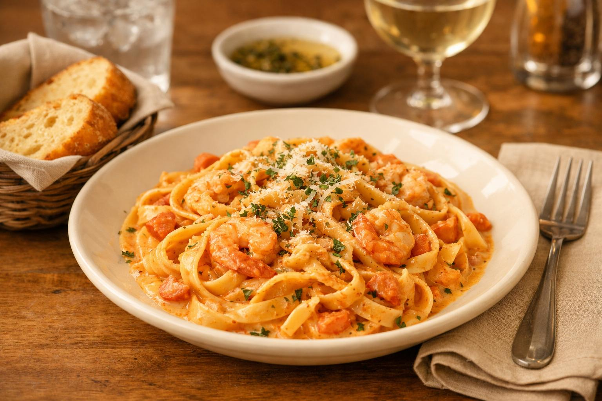
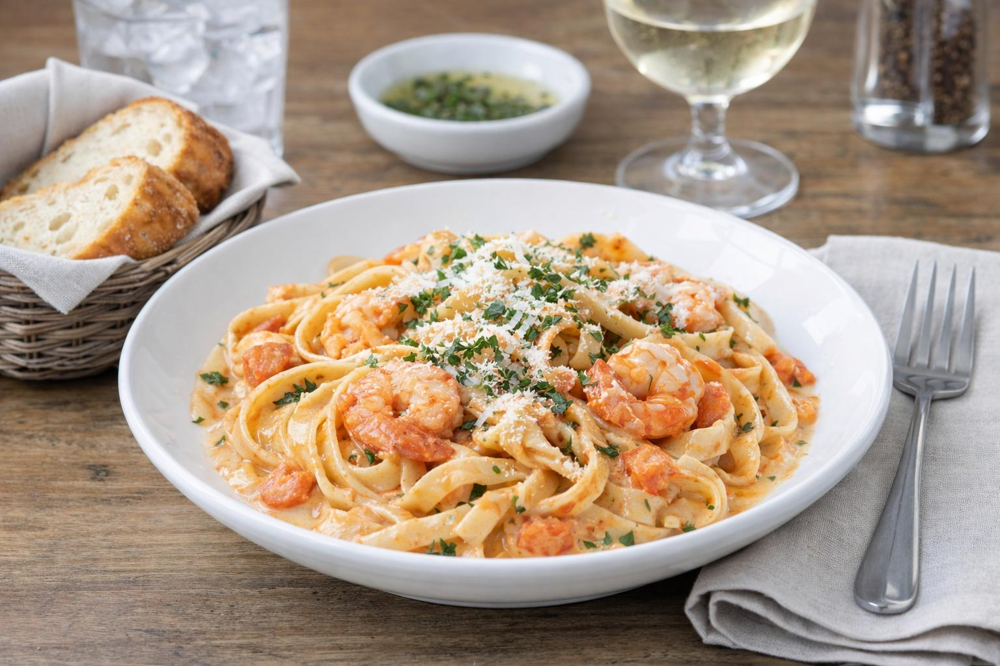
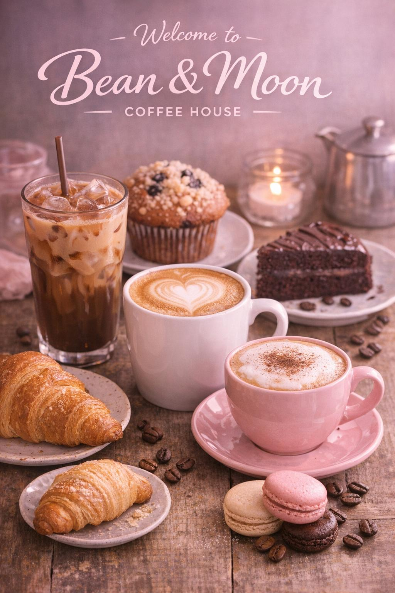
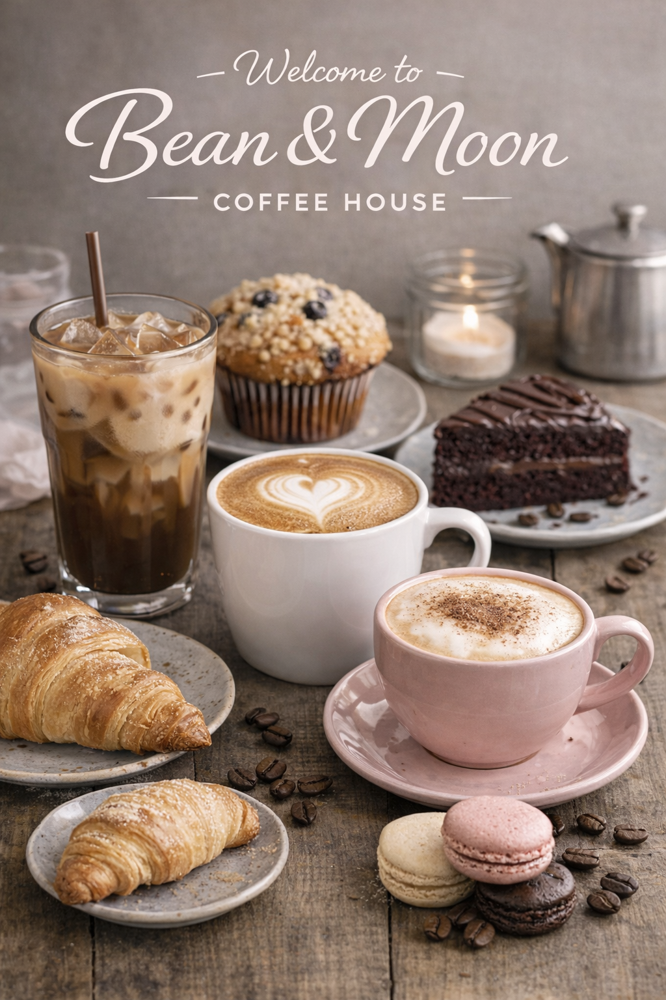
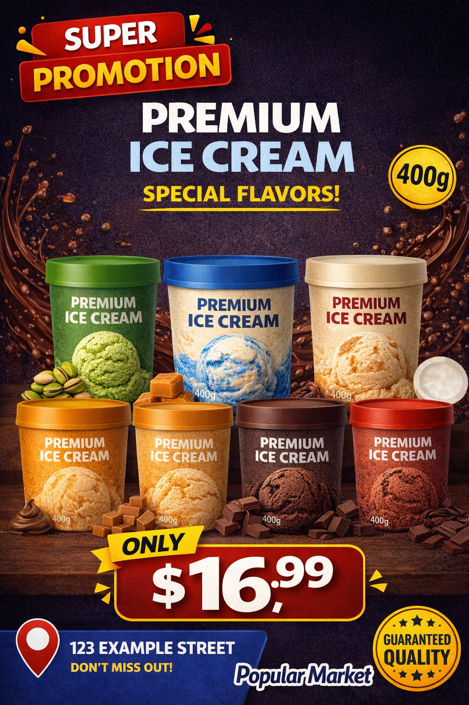
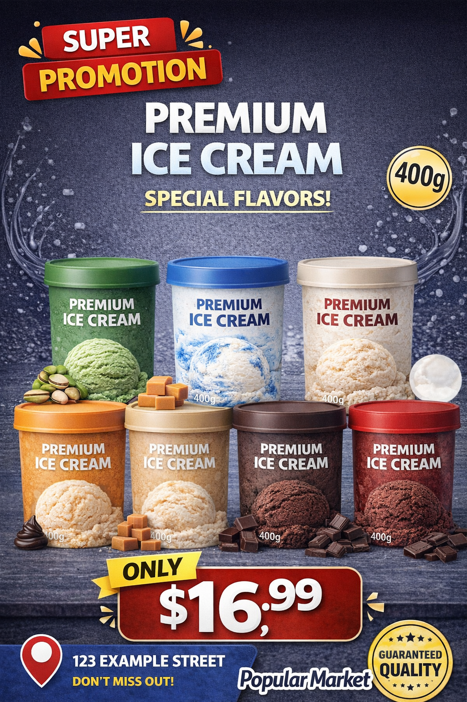

<div align="center">

# 🎨 Sepia Be Gone


<br/><br/>

**A portable prompt skill to banish the yellow/orange/sepia filter from AI-generated images.**  
Works with **opencode**, **Claude Code**, **Codex**, **Cursor**, **Windsurf**, **VS Code Copilot**, and any image generator.

<br/>

> *"AI doesn't have to look like it was developed in a 1970s darkroom."*

</div>

---

## 🤔 The Problem: Why AI Images Look Yellow

AI image models don't just "learn from old paintings." The yellow/orange cast comes from **token bias** in training data:

| 🎯 Prompt Keyword | 📊 Statistical Association | 🎨 Result |
|:---|:---|:---|
| `cinematic` | Orange/teal grading (Hollywood LUTs) | Heavy amber cast |
| `golden hour` | Warm sunset lighting | Extreme yellow/orange |
| `premium`, `luxury` | Warm "golden" commercial photography | Cream whites, brown blacks |
| `appetizing` (food) | Golden food photography overlays | Greens→brown, whites→cream |
| `studio lighting` | Often tungsten (3200K) not daylight | Warm color temperature |
| `dramatic lighting` | Chiaroscuro with warm key lights | Orange shadows |

**RLHF amplifies this**: Human raters consistently prefer warmer images for "appeal," so models learn **warmth = quality**.

---

## ✨ What This Skill Does

| ✅ **Preserves** | 🎯 **Applies** | 🚫 **Removes** |
|:---|:---|:---|
| Layout & composition | Neutral 5600K daylight balance | Yellow tint |
| Products & packaging | Clean whites (RGB 255,255,255) | Orange cast |
| Logos & labels | Deep neutral blacks (RGB 0,0,0) | Warm filter |
| Prices & addresses | Accurate product/brand colors | Sepia tone |
| **ALL visible text** | Natural contrast, crisp lighting | Amber / golden hour |
| Design structure & spacing | Modern commercial look | Vintage grading |

---

## 🖼 Before → After Examples — See It In Action

> **Real results from the skill** — no cherry-picking, just the prompt applied to yellow-tinted images.

---

### 1️⃣ 🛒 Supermarket Promo Poster

**Problem**: Yellow/orange cast — cream whites, amber shadows, inaccurate brand blues

| Before (Yellow Tint) | After (Neutral) |
|:---:|:---:|
|  |  |

**Preserved**: Price ($3.99), address (123 Main St), product placement, logo, layout  
**Fixed**: 5600K daylight balance, clean whites, neutral grays, accurate brand blues  
**Prompt used**: Full prompt from [`prompts/neutral_color_balance.md`](prompts/neutral_color_balance.md)

---

### 2️⃣ 🍔 Food Photography

**Problem**: Golden "appetizing" overlay — brownish greens, yellow whites, artificial warmth

| Before (Warm Filter) | After (Color-Accurate) |
|:---:|:---:|
|  |  |

**Preserved**: Food appeal, composition, plating  
**Fixed**: Fresh greens, clean whites, natural meat tones, no golden overlay  
**Prompt used**: Food variant from [`prompts/neutral_color_balance.md`](prompts/neutral_color_balance.md)

---

### 3️⃣ 🎬 Cinematic / Fantasy Art

**Problem**: Heavy orange/teal grading — orange skin tones, teal shadows, sepia haze

| Before (Orange/Teal) | After (Neutral Fantasy) |
|:---:|:---:|
|  |  |

**Preserved**: Composition, characters, mood, detail  
**Fixed**: Natural skin, neutral shadows, readable text, no orange cast  
**Prompt used**: Cinematic variant from [`prompts/neutral_color_balance.md`](prompts/neutral_color_balance.md)

---

## 🚀 Quickstart

### 📦 Installation by Tool

<table>
<tr>
<td width="50%">

#### 🐙 opencode
```bash
git clone https://github.com/BrunosGits/sepia-be-gone.git ~/.config/opencode/skill/sepia-be-gone
# Use: /sepia-be-gone
```

#### 🤖 Claude Code
```bash
git clone https://github.com/BrunosGits/sepia-be-gone.git ~/.claude/skills/sepia-be-gone
# Use: /sepia-be-gone
```

#### ⚡ Codex / Generic Agents
```bash
git clone https://github.com/BrunosGits/sepia-be-gone.git .github/skills/sepia-be-gone
# Use: /sepia-be-gone
```

</td>
<td width="50%">

#### 🎯 Cursor
```bash
# Copy CURSOR.md to:
~/.cursor/rules/sepia-be-gone.mdc
# Or project: .cursor/rules/
# Use: @sepia-be-gone in chat
```

#### 🌊 Windsurf
```bash
# Copy WINDSURF.md to:
~/.codeium/windsurf/skills/sepia-be-gone/
# Use: /sepia-be-gone in Cascade
```

#### 💻 VS Code Copilot
```bash
# Add VSCODE.md content to:
.github/copilot-instructions.md
# Use: "Use sepia-be-gone skill" in chat
```

</td>
</tr>
</table>

### 🎨 Any Image Generator
Works with **DALL-E 3**, **Midjourney**, **GPT-4o**, **Gemini**, **Firefly**, **Stable Diffusion**, **Flux**, etc.

```bash
cat prompts/neutral_color_balance.md | pbcopy
# Paste at end of your prompt
```

---

## 📋 The Prompt (Copy-Paste Ready)

### 📄 Full Prompt
→ [`prompts/neutral_color_balance.md`](prompts/neutral_color_balance.md)

### ⚡ Short Add-on (append to any prompt)
```
Color grading: neutral daylight-balanced white balance, accurate colors, clean whites, neutral blacks, no yellow tint, no sepia, no orange cast, no warm filter, no vintage grading, no golden-hour lighting.
```

### 🚫 Negative Prompt (if supported)
```
yellow tint, orange cast, warm filter, sepia, amber lighting, vintage color grading, old painting, golden hour, aged paper, brown overlay, muddy colors, oversaturated orange, excessive warmth, cream whites, brown blacks
```

> **Midjourney**: Add `--no yellow tint, orange cast, warm filter, sepia, amber lighting, vintage color grading, old painting, golden hour, aged paper, brown overlay, muddy colors, oversaturated orange, excessive warmth, cream whites, brown blacks`  
> **Stable Diffusion**: Paste into negative prompt box

## 🎯 When to Use

<details>
<summary><b>Click to expand trigger phrases</b></summary>

- "Remove the yellow tint" / "Remove yellow filter"
- "Make this less warm" / "Too warm" / "Fix warm colors"
- "Neutralize colors" / "Neutral color balance"
- "Clean whites" / "Whites look cream" / "Whites are yellow"
- "Remove orange cast" / "Too orange"
- "Remove sepia" / "Looks vintage" / "Old photo look"
- "Fix AI yellow filter" / "AI yellow tint"
- "5600K" / "Daylight balanced" / "Neutral lighting"

</details>

---

## ⚠️ Limitations & Workarounds

| Limitation | Severity | Workaround |
|:---|:---:|:---|
| **Generative editors distort text** | 🔴 High | For posters with exact prices/addresses: generate background only → add text in Figma/Canva/Photoshop |
| **Deliberate warm/vintage style** | 🟡 Medium | Don't use — this skill forces neutral |
| **Extreme orange casts (sunset)** | 🟡 Medium | May need 2-pass editing |
| **Local color casts only** | 🟢 Low | Use generative inpainting for specific regions |

---

## 📁 Repository Structure

```
sepia-be-gone/
├── 📄 README.md                          # This file (with inline examples)
├── ⚙️  SKILL.md                           # opencode skill (primary)
├── 🤖 AGENTS.md                          # Codex/opencode adapter
├── 🤖 CLAUDE.md                          # Claude Code adapter
├── 🎯 CURSOR.md                          # Cursor IDE rule (.mdc)
├── 🌊 WINDSURF.md                        # Windsurf Cascade skill
├── 💻 VSCODE.md                          # VS Code Copilot instructions
├── ⚖️  LICENSE                            # MIT
├── 📁 prompts/
│   └── 🎨 neutral_color_balance.md       # The reusable prompt
└── 📁 examples/
    └── 📁 images/
        ├── 📁 before/                     # Your yellow-tinted inputs
        │   ├── poster-yellow.jpg
        │   ├── food-warm.jpg
        │   └── cinematic-orange.jpg
        └── 📁 after/                      # Your corrected outputs
            ├── poster-neutral.jpg
            ├── food-neutral.jpg
            └── cinematic-neutral.jpg
```

---

## 🛠 How It Works

### 🎭 Generative Prompt Strategy
The prompt uses **three mechanisms**:

1. **Explicit preservation directives** — "Preserve: layout, text, logos, prices, addresses"
2. **Positive color specification** — "5600K daylight-balanced", "clean whites", "neutral blacks"
3. **Negative constraint list** — 15+ forbidden terms (yellow tint, sepia, golden hour, vintage, etc.)

This exploits how diffusion models attend to both positive and negative token guidance.

### 🎯 Target Color Temperature
| Lighting Type | Kelvin | Use Case |
|:---|:---:|:---|
| Tungsten (warm) | 3200K | ❌ Avoid |
| Golden Hour | 3500-4500K | ❌ Avoid |
| **Daylight Neutral** | **5500-5600K** | ✅ **Target** |
| Overcast Daylight | 6500K | ✅ Acceptable |
| Cool Studio | 7000K+ | ⚠️ May overcorrect |

---

## 🤝 Contributing

Found a better prompt variant? Discovered a new tool integration?  
PRs welcome! Please read the skill files before modifying.

---

## 📜 License

**MIT License** — Free for personal and commercial use.  
See [`LICENSE`](LICENSE) for full text.

---

<div align="center">

### 🌟 Star this repo if it saved your images from the yellow filter!

**Made with ☕ by [BrunosGits](https://github.com/BrunosGits)**

</div>